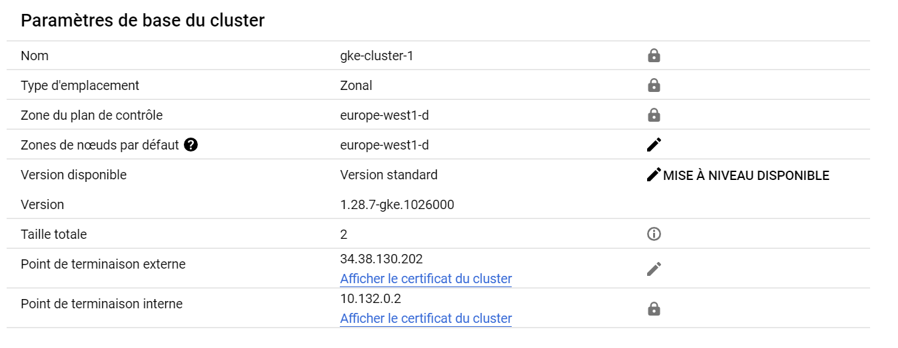
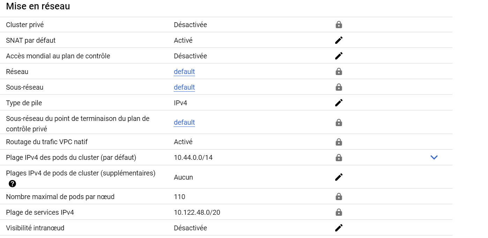

# Task 2 - Deploy the application in Kubernetes Engine

In this task you will deploy the application in the public cloud service Google Kubernetes Engine (GKE).

## Subtask 2.1 - Create Project

Log in to the Google Cloud console at <http://console.cloud.google.com/>, navigate to the __Resource Manager__ (<https://console.cloud.google.com/cloud-resource-manager>) and create a new project. 

## Subtask 2.2 - Create a cluster

Go to the Google Kubernetes Engine (GKE) console (<https://console.cloud.google.com/kubernetes/>). If necessary, enable the Kubernetes Engine API. Then create a cluster. 

* Choose a __GKE Standard__ cluster. (Please ensure that you are not using the Autopilot. The button to switch to Standard could be a bit tricky to find...)
* Give it a __name__ of the form _gke-cluster-1_
* Select a __region__ close to you.
* Set the __number of nodes__ to 2. 
* Set the __instance type__ to micro instances.
* Set the __boot disk size__ to 10 GB.
* Keep the other settings at their default values.

## Subtask 2.3 - Deploy the application on the cluster

Once the cluster is created, the GKE console will show a __Connect__ button next to the cluster in the cluster list. Click on it. A dialog will appear with a command-line command. Copy/paste the command and execute it on your local machine. This will download the configuration info of the cluster to your local machine (this is known as a _context_). It also changes the current context of your `kubectl` tool to the new cluster.

To see the available contexts, type :

```sh
$ kubectl config get-contexts
```

You should see two contexts, one for the Minikube cluster and one for the GKE cluster. The current context has a star `*` in front of it. The `kubectl` commands that you type from now on will go to the cluster of the current context.

With that you can use `kubectl` to manage your GKE cluster just as you did in task 1. Repeat the application deployment steps of task 1 on your GKE cluster.

Should you want to switch contexts, use :

```sh
$ kubectl config use-context <context>
```

## Subtask 2.4 - Deploy the ToDo-Frontend Service

On the Minikube cluster we did not have the possibility to expose a service on an external port, that is why we did not create a Service for the Frontend. Now, with the GKE cluster, we are able to do that.

Using the `redis-svc.yaml` file as an example, create the `frontend-svc.yaml` configuration file for the Frontend Service.

Unlike the Redis and API Services the Frontend needs to be accessible from outside the Kubernetes cluster as a regular web server on port 80.

  * We need to change a configuration parameter. Our cluster runs on the GKE cloud and we want to use a GKE load balancer to expose our service.
  * Read the section "Publishing Services - Service types" of the K8s documentation 
    <https://kubernetes.io/docs/concepts/services-networking/service/#publishing-services-service-types>
  * Deploy the Service using `kubectl`.

This will trigger the creation of a load balancer on GKE. This might take some minutes. You can monitor the creation of the load balancer using `kubectl describe`.

### Verify the ToDo application

Now you can verify if the ToDo application is working correctly.

  * Find out the public URL of the Frontend Service load balancer using `kubectl describe`.
  * Access the public URL of the Service with a browser. You should be able to access the complete application and create a new ToDo.


## Deliverables

Document any difficulties you faced and how you overcame them. Copy the object descriptions into the lab report (if they are unchanged from the previous task just say so).

> 1. We had the following error while trying to get the credentials for the cluster:

As it is said in the error, we first ran this command to install the missing component : `gcloud components install gke-gcloud-auth-plugin`, then we ran this to get the credentials : `gcloud container clusters get-credentials`

```````
The previous components we install didn't change at all, thus we judged it wasn't necessary to copy/paste a lot of code again
```````

```yaml
# frontend-svc.yaml
apiVersion: v1
kind: Service
metadata:
  labels:
    component: frontend
  name: frontend-svc
spec:
  ports:
  - port: 80
    targetPort: 8080
    name: frontend
  selector:
    app: todo
    component: frontend
  type: LoadBalancer
```

Take a screenshot of the cluster details from the GKE console. Copy the output of the `kubectl describe` command to describe your load balancer once completely initialized.




```````
// Load balancer
Name:                     frontend-svc
Namespace:                default
Labels:                   component=frontend
Annotations:              cloud.google.com/neg: {"ingress":true}
Selector:                 app=todo,component=frontend
Type:                     LoadBalancer
IP Family Policy:         SingleStack
IP Families:              IPv4
IP:                       10.122.51.177
IPs:                      10.122.51.177
LoadBalancer Ingress:     35.187.49.52
Port:                     frontend  80/TCP
TargetPort:               8080/TCP
NodePort:                 frontend  31464/TCP
Endpoints:                10.44.1.5:8080
Session Affinity:         None
External Traffic Policy:  Cluster
Events:
  Type    Reason                Age    From                Message
  ----    ------                ----   ----                -------
  Normal  EnsuringLoadBalancer  8m36s  service-controller  Ensuring load balancer
  Normal  EnsuredLoadBalancer   7m56s  service-controller  Ensured load balancer
```````
